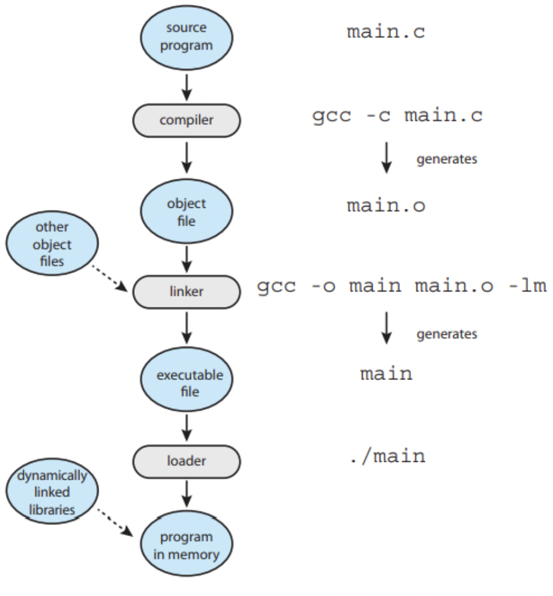

# Linker

- 프로그램은 Disk에서 binary executable file로 저장 
- 프로그램 실행 시 Disk에서 binary executable file을 메모리에 적재해 실행 
  - 이 상태를 프로세스라고 표현

1. compiler : source program → object file / 소스 코드를 바이너리 코드로 변환
2. linker : object file → executable file / relocatable object file들을 연결하여 single binary executable file로 변환하는 역할
3. loader : executable file → program in memory / executable file을 memory에 적재하는 역할
4. ./main : exec() 계열 함수(시스템 콜)를 통해서 새로운 process가 생성
5. build = source program이 compiler와 linker를 거쳐 executable file이 되는 과정
6. dll(dynamically linked libraries) : 런타임에 동적으로 링크되는 라이브러리로, 프로그램 시작 시 또는 실행 중에 필요에 따라 링크  여러 프로세스들이 DLL을 공유하여 메모리 절약
7. object file : 컴파일, 어셈블리를 통해 변환된 파일 (기계어), relocatable object file(ELF 포맷)