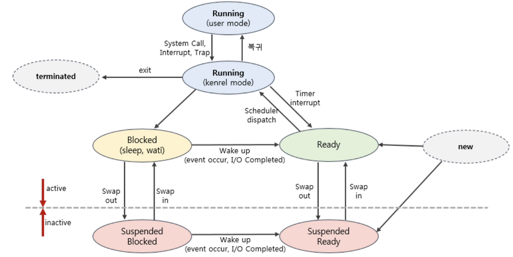

# 프로세스 상태 

- Running (user mode)
    - 사용자 공간에서 프로세스가 실행 중인 상태
    - CPU를 할당받아 사용자 코드를 수행
- Running (kernel mode)
    - 커널 공간에서 프로세스가 실행 중인 상태
    - 시스템 호출, 인터럽트, 트랩 처리 중
- Ready
    - CPU 할당을 기다리는 상태
    - 실행 준비는 완료되었으나 스케줄링 대기 중
    - 메모리에 적재된 활성 상태
- Blocked (sleep, wait)
    - I/O 작업이나 이벤트 완료를 기다리는 상태  
    - CPU를 할당받아도 실행할 수 없음
    - 메모리에 적재된 활성 상태
- Suspended Ready
    - Ready 상태이지만 메모리에서 스왑아웃된 비활성 상태
    - CPU 할당 시 스왑인 후 실행 가능
- Suspended Blocked
    - Blocked 상태이면서 메모리에서 스왑아웃된 비활성 상태
    - 이벤트 완료와 스왑인이 모두 필요
- New
    - 프로세스가 새로 생성된 초기 상태
    - 아직 Ready 큐에 진입하지 않음
- Terminated
    - 프로세스 실행이 완료되어 종료된 상태
    - 시스템에서 제거되기 전 임시 상태

# 스케줄러 

- 장기 스케줄러(Long-term scheduler, Job Scheduler)
    - ready queue로 보낼 시작 프로세스를 결정하는 스케줄러
    - 프로세스에 메모리 및 각종 리소스를 전달하는 역할 담당
    - degree of Multiprogramming 제어 
    - 시분할 시스템에서는 사용되지 않음 
        - 프로세스 생성 시 무조건 ready 상태가 되어 ready queue에 적재 
- 단기 스케줄러(Short-term scheduler, CPU scheduler)
    - ready 상태의 프로세스 중 어떤 프로레스를 running 할 것인지를 결정하는 스케줄러
    - 프로세스에게 CPU 할당하는 역할 담당 
    - 충분히 빨라야 함 (ms 단위)
- 중기 스케줄러(Medium-term scheduler, Swapper)
    - 메모리 여유 공간을 위해 프로세스를 메모리에서 디스크로 쫓아냄(Swap)
    - 프로세스로부터 메모리를 뺏는 역할 담당
    - degree of Multiprogramming 제어

# 동기식 입출력, 비동기식 입출력

- 동기식 입출력 (synchronous I/O)
    - I/O 요청 후 입출력 작업이 완료된 후 제어가 유저 레벨 프로세스에게 넘어감
        - 단일 CPU 기준 구현 방식
            - 첫 번째
                - I/O가 끝날 때 까지 CPU 대기 -> 낭비
                - 매 시점 하나의 I/O만 발생
            - 두 번째
                - I/O가 완료될 때 까지 해당 프로세스에게서 CPU를 뺏음
                - I/O 이벤트가 발생한 프로세스는 I/O Blocking Queue에 적재 
- 비동기식 입출력 (asynchronous I/O)
    - I/O가 시작된 이후 입출력 작업이 끝나기를 기다리지 않고 제어가 바로 유저 레벨 프로세스에게 넘어감