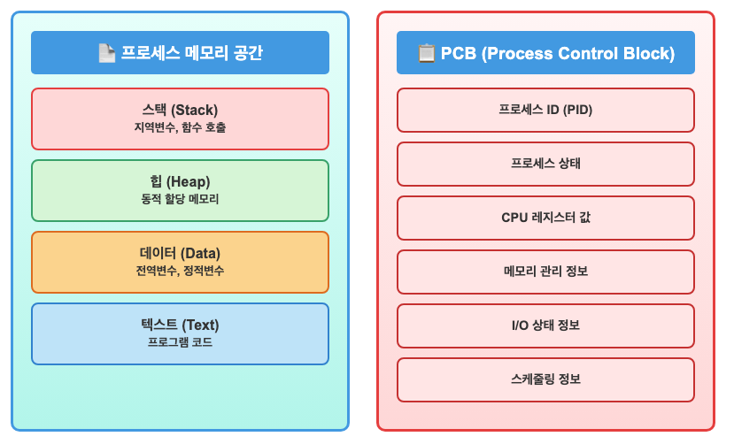
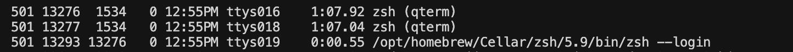

## 1. 프로세스란?
- 실행중인 프로그램
- .exe같은 실행파일이 아닌, CPU에서 돌아가고 있는 실행 인스턴스
- `htop` 명령어로 확인 가능
    
- 초기 컴퓨터 VS 다중 태스킹 개념 등장 후
    
- 초기 컴퓨터는 하나의 프로그램만 순차적으로 실행했기 때문에 프로세스라는 명확한 구분이 없었고, 프로그램이 메모리에 올라와 실행되는 그 자체가 프로세스였다
- 다중 태스킹 개념이 등장하며, 여러 프로세스가 동시에 실행할 수 있게되고 운영체제는 이를 효율적으로 다루기 위해 프로세스 생성, 스케줄링, 동기화 등 명확한 프로세스 관리기능을 갖추게 됐다

## 2. 프로세스 상태
- new: 생성 중
- running: 실행 중
- waiting: 이벤트(입출력완료/신호 수신 등)가 일어나기를 대기 중
- ready: 처리기에 할당되기를 기다리는 중
- terminated: 프로세스 실행 종료

=> 이 정보를 보고 어떤 프로세스를 다음에 실행할지 결정

## 3. 프로세스 구조: 프로그램 코드 + 실행 상태 정보(PCB)

- 프로세스 메모리 공간: 실제 프로그램이 돌아가는 공간
    - 프로그램이 직접 사용
    - 실제 내용
- PCB: OS가 프로세스를 관리하기 위한 정보
    - 운영체제가 프로세스를 제어하기 위해 사용
    - 관리 정보

## 4. 프로세스가 실행되는 과정
1. chrome.exe 디스크에 저장
2. 사용자가 프로그램 더블클릭(실행 요청)
3. 운영체제가 메모리(RAM) 공간 할당 + PCB 생성
    - 메모리에 공간 할당: 프로그램 실행되도록
        (코드가 로드되기 전 메모리 공간 확보)
    - PCB 생성: 프로세스 관리를 위한 정보 저장
4. 디스크에서 메모리(RAM)로 프로그램 코드 로딩
    (확보한 메모리 공간으로 코드와 데이터 복사)
5. 프로세스 상태: running
6. 프로세스 종료
    - 프로세스 상태: terminated
    - 메모리 공간 해제
    - PCB 제거

## 5. 시스템 콜
- fork(): 프로세스 복사: 프로세스 복사 후 새로운 프로세스 생성
- exec(): 프로세스 실행: 프로세스 실행
- wait(): 프로세스 종료 대기: 프로세스 종료 대기
- exit(): 프로세스 종료: 프로세스 종료(프로세스 종료 시 메모리 해제)

## 6. 예시코드

[파이썬]
```python
import os

print(os.getpid())

os.fork()

print(os.getpid())
```

[리눅스 PID 확인]
```bash
$ ps -ef
```
#### 프로세스 목록 출력

### UID - PID - PPID - C - STIME - TTY - TIME - CMD
    - UID: 사용자 ID
    - PID: 프로세스 ID
    - PPID: 부모 프로세스 ID
    - C: CPU 사용량(%)
    - STIME: 시작 시간
    - TTY: 터미널 장치
    - TIME: 누적 CPU 사용 시간

[참고]
- https://ko.wikipedia.org/wiki/%ED%94%84%EB%A1%9C%EC%84%B8%EC%8A%A4
- 각종 AI