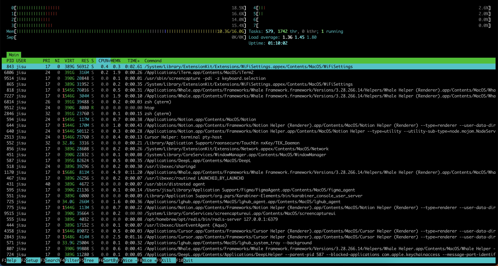

## 1. 프로세스란?
- 실행중인 프로그램
- `htop` 명령어로 확인 가능
    
- 초기 컴퓨터 VS 다중 태스킹 개념 등장 후
    
- 초기 컴퓨터는 하나의 프로그램만 순차적으로 실행했기 때문에 프로세스라는 명확한 구분이 없었고, 프로그램이 메모리에 올라와 실행되는 그 자체가 프로세스였다
- 다중 태스킹 개념이 등장하며, 여러 프로세스가 동시에 실행할 수 있게되고 운영체제는 이를 효율적으로 다루기 위해 프로세스 생성, 스케줄링, 동기화 등 명확한 프로세스 관리기능을 갖추게 됐다

## 2. 프로세스 상태
- new: 생성 중
- running: 실행 중
- waiting: 이벤트(입출력완료/신호 수신 등)가 일어나기를 대기 중
- ready: 처리기에 할당되기를 기다리는 중
- terminated: 프로세스 실행 종료

## 3. 프로세스 구조

## 4. 프로세스가 실행되는 과정

## 5. 시스템 콜
- fork()
- exec()
- wait()
- exit()

## 6. 예시코드
```python

```

[참고]
- https://ko.wikipedia.org/wiki/%ED%94%84%EB%A1%9C%EC%84%B8%EC%8A%A4