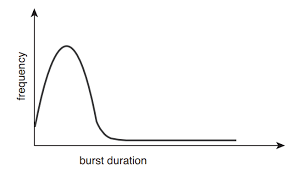

# CPU 스케줄링
* 최신 운영체제에서는 커널 수준 스레드를 스케줄한다. 
* '코어' 가 CPU 기본 계산 단위
* 'CPU 에서 실행된다' == 프로세스가 CPU 코어에서 실행되고 있음

# 5.1. CPU 이용률을 최대화하기
항상 실행 중인 프로세스를 가지게 하기
* 하나의 프로세스는, 어떤 i/o 요청이 완료되기를 기다려야만 할 때까지 실행됨(CPU는 놀고있게 됨)
* 다중 프로그래밍에서는 이러한 시간 생산적으로 활용하도록 시도함 (어느 순간에 다수읲 프로세스를 메모리 내에 유지)
* 어떤 프로세스가 대기해야 할 경우, 운영체제는 CPU를 그 프로세스로부터 회수해 다른 프로세스에 할당함
* 모든 컴퓨터 자원은 사용되기 전에 스케줄 된다. 

## 5.1.1. CPU -I/O 버스트 사이클
프로세스의 실행 : CPU 실행 <> I/O 대기의 사이클
* 프로세스 실행은 CPU burst -> I/O burst -> CPU burst ...-> 마지막 CPU Burst & 실행종료 시스템 요청
* CPU 버스트 지속시간 히스토그램 : 버스트 duration짧은게 빈도가 압도적으로 높음\
(I/O바운드) 



## 5.1.2. CPU 스케줄러
CPU는 유휴상태가 될 때마다
* CPU 스케줄러 : ready Q에 있는 프로세스 중에서 선택해서 이들 중 하나에게 CPU를 할당해줌
* ready Q : 반드시 FIFO는 아님 (여러 스케줄링 알고리즘)
| ready Q에 있는 모든 프로세스는 CPU에서 실행될 기회를 기다리며 대기하고 있으며, 큐에 있는 레코드들은 일반적으로 프로세스들의 PCB

## 5.1.3. 선점 및 비선점 스케줄링
* **비선점 스케줄링 (Non-preemptive)**: 프로세스가 스스로 CPU를 반납할 때만 스케줄링 발생 (예: Case 1, 4)

* **선점 스케줄링 (Preemptive)**: 운영체제가 강제로 CPU를 회수해서 다른 프로세스에게 할당 (예: Case 2)


CPU 스케줄링 결정 Case
| . | 상태 전이 (State Transition)  | 설명                                            | 스케줄링 필요 여부   | 선점 가능 여부              |
| --- | ------------------------- | --------------------------------------------- | ------------ | --------------------- |
| Case1   | 실행(Running) → 대기(Waiting) | 프로세스가 I/O 요청 또는 `wait()` 호출로 CPU 사용을 자발적으로 중단 | ✅ 필요함        | ❌ 비선점 (자발적 양보)        |
| Case2   | 실행(Running) → 준비(Ready)   | 타이머 인터럽트 발생 등으로 CPU 사용 중이던 프로세스가 중단됨          | ✅ 필요함        | ✅ 선점 (강제 중단)          |
| Case3   | 대기(Waiting) → 준비(Ready)   | I/O 작업 완료로 대기 중이던 프로세스가 실행 가능 상태로 전환됨         | 🔁 필요할 수도 있음 | ❌ 비선점 (기존 프로세스 실행 유지) |
| Case4   | 프로세스 종료                   | 실행 중이던 프로세스가 종료됨                              | ✅ 필요함        | ❌ 비선점 (자연 종료)         |

| 선점 스케줄은 경쟁조건 초래할 수 있다.
* 두 프로세스가 자료 공유하는 경우
* 한 프로세스가 자료 갱신하는 동안 선점되어 두 번째 프로세스가 실행 가능한 상태가 될 수 있다.
* 두 번째 프로세스가 데이터 읽으려고 할 때, 데이터 일관성은 이미 깨진 상태

| 선점 스케줄은 운영체제 커널 설계에 영향을 준다. 
* 커널이 시스템 콜을 처리할 동안, 커널은 내부 자료구조(I/O 큐, 파일 테이블 등)를 변경할 수 있습니다.
* 그런데 이시점(커널 자료 변경 도중)에 커널이 다른 프로세스에 의해 선점되고, 커널이 동일한 자료구조 접근하려 하면 데이터 손상/시스템 충돌
* 예시
  * 프로세스 A가 커널 내의 파일 디스크립터 테이블을 갱신하는 도중 선점됨
  * 프로세스 B가 같은 파일 디스크립터 테이블에 접근하여 데이터를 읽거나 수정하려고 시도
  * A의 작업이 아직 완료되지 않아, B는 중간 상태의 데이터를 읽게 되고 → 예기치 않은 결과 초래

* 해결책
  * 운영체제 커널을 비선점형 커널로 설계
    * 비선점형 커널 : 문맥교환 하기 전에 시스템 콜 완료/ 입출력 완료 기다리며 프로세스가 봉쇄되기를 기다림

    * 그러나 주어진 시간안에 태스크 실행 완료 못하게됨
  * 선점형 커널에서 공유데이터 접근 시 뮤텍스/락 기법

* 인터럽트는 어느 시점에서건 일어날 수 있음 
    * -> 인터럽트 영향 받는 코드는 반드시 동시 사용으로부터 보호되어야 한다.
* 인터럽트 불능화

| 항목              | 설명                                 |
| --------------- | ---------------------------------- |
| 왜 인터럽트를 꺼야 하나요? | 중요한 작업 도중 끼어들면 데이터가 망가질 수 있기 때문    |
| 언제 꺼야 하나요?      | 공유 데이터 수정, I/O 큐 같은 커널 자료 구조를 바꿀 때 |
| 어떻게 꺼야 하나요?     | 진입할 때 인터럽트 비활성화, 빠르게 처리 후 다시 활성화   |
| 주의사항            | 꺼놓는 시간은 아주 짧게! 너무 자주 쓰면 시스템이 느려져요  |

## 5.1.4. 디스패쳐(Dispatcher)
CPU 스케줄러가 선택한 프로세스에게 CPU 코어의 제어를 넘겨 주기
* 한 프로세스에서 다른 프로세스로 문맥 교환
* 사용자 모드로 전환
* 프로그램 다시 시작하기 위해 사용자 프로그램의 적절한 위치로 이동(jump)

* 디스패치 지연 (dispatch latency)
    * 디스패쳐는 모든 프로세스의 문맥 교환 시 호출됨 -> 가능한 한 최고로 빨리 수행되어야함
* 문맥 교환이 얼마나 자주 발생하는가? vm_stat명령
```bash
# 시스템 부팅 이후 1초 단위의 평균 문맥 교환 횟수 , 1초 동안 문맥 교환 횟수
vmstat 1 5
```
* /proc 파일시스템 : 특정 프로세스에 대한 문맥교환 횟수 결정
```bash
# pid=2166인 프로세스에 대한 문맥교환 통계
cat /proc/2166/status
```
* 자발적 문맥교환 : 현재 사용 불가한 자원(I/O요청)을 요청해서 프로세스가 스스로 CPU제어를 포기한 경우
* 비자발적 문맥교환 : CPU 를 "빼앗겼을'때 - 타임슬라이스 만료 or 다른 프로세스에 의해 선점됨

# 5.2. 스케줄링 방식을 비교하는 기준
* CPU 이용률  : 40%~90% 적정
* 처리량 : 단위시간당 완료된 프로세스 갯수
----
* 총 처리 시간 : 프로세스 제출시간 - 완료시간 (준비큐에서의 대기시간 + CPU실행시간 + I/O시간)
* 대기시간 : 스케줄링 알고리즘은 프로세스가 준비큐에서 대기하는 시간의 양에만 영향을 줌 (CPU실행, I/O실행시간에는 영향 미치지 않음)
* 응답시간 : "얼마나 빨리 반응이 시작되는가?" 
    * 예시로 이해하기:
        * 웹 검색: 검색 버튼을 누른 후, 화면에 검색 결과 목록이 뜨기 시작하는 그 순간까지가 '응답 시간'입니다. 모든 이미지가 로딩되고 페이지가 완전히 뜨는 시간은 '총 처리 시간'에 가깝습니다.
        * 커피 주문: 키오스크에서 주문을 완료하자마자 "주문번호 00번 접수되었습니다!"라는 메시지가 화면에 뜨는 것과 같습니다. 커피가 실제로 나오는 시간과는 다른 개념이죠.
    * 핵심:
        * 사용자가 "내 명령을 컴퓨터가 알아듣고 일하기 시작했구나"라고 인지하게 만드는, **'첫 반응의 속도'** 가 바로 응답 시간

# 5.3. 스케줄링 알고리즘
* CPU 스케줄링은 준비 큐에 있는 어느 프로세스에 CPU코어를 할당할지 결정한다.
* 가정 : 한 번에 하나의 프로세스만 실행

## 5.3.1. 선입 선처리 스케줄링 (First come First Served)
* 비선점형
* 순서
    * cpu 먼저 요청하는 프로세스가 먼저 할당받는다.
    * 프로세스가 준비큐에 진입하면, 프로세스와 PCB 큐의 맨 끝에 연결한다. 
    * CPU 가 가용 상태가 되면, 준비 큐의 앞부분에 있는 프로세스에 할당(이제 실행 상태)
    * 마지막, 실행 상태 프로세스는 준비 큐에서 제거된다. 
* 단점 : 평균 대기시간 길다, 프로세스 순서에 따라 평균대기시간 변함
* 다이나믹 상황에서의 성능
    * 하나의 CPU bound 프로세스 & 다수 I/O bound 프로세스
    * **(convoy effect)** CPU bound 가 CPU 점유하고 있는 동안 모든 I/O프로세스들은 그것을 기다린다. 

## 5.3.2. 최단 작업 우선 스케줄링 (Shortest Job First)
* 각 프로세스에 다음 CPU 버스트 길이 연관시킴
* CPU 가 이용가능해지면, 가장 작은 다음 CPU 버스트 가진 프로세스에 할당함
* 다음 CPU버스트가 동일한 길이를 가지면, 순위 정하기 위해 선입 선처리 스케줄링
* 최단 **"다음"** CPU버스트
* 짧은 프로세스의 대기시간을 줄이는데 이것이 긴 프로세스의 대기시간이 증가하는 마이너스효과보다 더 크다.
* 결과적으로 평균 대기시간이 줄어든다.
* 다음 CPU 버스트 시간 예측 방법
    * 이전의 CPU버스트들의 길이를 지수평균한 것

## 5.3.3. Round Robin
## 5.3.4. Priority
## 5.3.5. Multilevel Q
## 5.3.6. Multilevel Feedback Q

# 5.4. 스레드 스케줄링

# 5.5. 다중 처리기 스케줄링

# 5.6. 실시간 CPU 스케줄링

# 5.7. 운영체제 사례들

# 5.8. 알고리즘의 평가