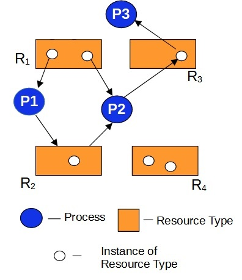

# Deadlock(교착상태)
### 한 자원에 대해 여러 프로세스가 무한정 기다리는 상태

## 발생 조건
1. 상호 배제(Mutual Exclusion)
    - 하나의 자원은 동시에 여러 프로세스가 사용 불가함
2. 점유와 대기(Hold and Wait)
    - 자원을 할당받은 상태에서 다른 프로세스를 기다리는 상태
3. 비선점(No Preemption)
    - 다른 프로세스의 자원을 강제로 빼앗을 수 없음
4. 원형 대기(Circular Wait)
    - 프로세스들이 자원을 요청하는 순서에 따라 순환 대기 상태가 발생

## 해결 방법
1. 예방(Prevention)
    - 발생조건을 적어도 하나라도 발생하지 않게 하는것
2. 회피(Avoidance)
    - 미리 부가적인 정보를 받아, 교착상태가 발생하지 않는 경우에만 자원을 할당하는 방법
3. 교착 상태 탐지 (Deadlock Detection)
    - 제약없이 할당하다가 교착 상태가 검출되면 교착 상태 회복

## 예방(Prevention)
교착 상태 발생 조건 중의 하나를 충족하지 못하게 하는 것

1. 상호배제
: 하나의 자원이 여러 프로세스가 사용
=> 현실적으로 불가. 프린터기 한대는 병렬적으로 프린트 할 수 없다.

2. 점유와 대기
: 자원을 모두 할당하거나 아예 할당하지 않거나
=> 자원을 모두 할당하는 것은 비효율적이고, 아예 할당하지 않는 것은 자원 낭비

3. 비선점
: 다른 프로세스 자원 강제로 빼앗기
=> CPU는 선점 가능한 자원. 프린터는 선점 불가능한 자원.

4. 원형대기조건
: 자원 요청 순서에 따라 처리하기
=> 자원 요청 순서에 따라 처리하기 어려움

## 회피(Avoidance)
교착 상태가 발생하지 않을 정도만 자원 할당
예: 프린터 3대가 있고 복사 프로세스가 1개면 교착상태는 발생하지 않는다
- 안전 상태(Safe State): 정상적으로 자원을 할당받고 종료될 수 있는 상태
- 불안전 상태(Unsafe State): 교착상태가 발생할 수도 있는 상황(안전 순서가 없는 상태)
- 안전 순서(Safe Sequence): 교착상태 없이 안전하게 할당할 수 있는 순서(안전순서가 있는 상태)

### Banker's Algorithm (은행원 알고리즘)
회피 방법의 대표적인 알고리즘
- 은행이 고객에게 대출을 줄 때처럼, 안전한 경우만 자원 할당
- 각 프로세스의 최대 필요량을 미리 알고 있어야함

프로세스 | 최대 필요량 | 현재 할당량 | 남은 필요량
P1 | 10 | 5 | 5
P2 | 4 | 2 | 2
P3 | 9 | 2 | 7
가용 자원: 3개

#### 안전 순서 찾기:
1. P2 실행 가능 (필요량 2 ≤ 가용량 3)
2. P2 완료 후 (3+2=5) 가용량 5개
3. P1 실행 가능 (필요량 5 ≤ 가용량 5)
4. P3 실행 가능
=> 안전 순서: P2 → P1 → P3

## 교착 상태 탐지 (Deadlock Detection)
교착상태가 발생하면 사후에 조치
프로세스들의 자원 요구를 모두 할당하고, 교착상태 여부를 주기적으로 검사

### Resource-Allocation Graph (자원 할당 그래프)
교착상태 탐지를 위한 그래프 기반 방법

#### 그래프 구성:

- 원: 프로세스
- 사각형: 자원 (점은 자원 개수)
- 화살표: 자원 요청/할당

#### 교착상태 탐지:
- 그래프에 사이클이 있으면 교착상태 가능성
- 사이클이 없으면 교착상태 없음

1. 프로세스 강제종료를 통한 회복
모두 강제종료하거나 한 프로세스씩 강제 종료
2. 선점을 통한 회복
교착상태가 해결될때까지 자원을 강제로 빼앗아 한 프로세스에 몰아줌

## 실제 시스템에서의 교착상태 예시

### 1. 데이터베이스 시스템
- 트랜잭션 A: 테이블1 락 → 테이블2 락 대기
- 트랜잭션 B: 테이블2 락 → 테이블1 락 대기

### 2. 운영체제
- 프로세스 A: 프린터 할당 → 스캐너 할당 대기
- 프로세스 B: 스캐너 할당 → 프린터 할당 대기

### 3. 네트워크
- 노드 A: 노드 B와 통신 대기
- 노드 B: 노드 A와 통신 대기

## 교착상태 vs 기아상태(Starvation)

### 교착상태 (Deadlock)
- 무한정 대기 (해결 불가능)
- 모든 프로세스가 대기 상태

### 기아상태 (Starvation)
- 특정 프로세스만 계속 대기
- 다른 프로세스는 정상 실행
- 시간이 지나면 해결될 수 있음
